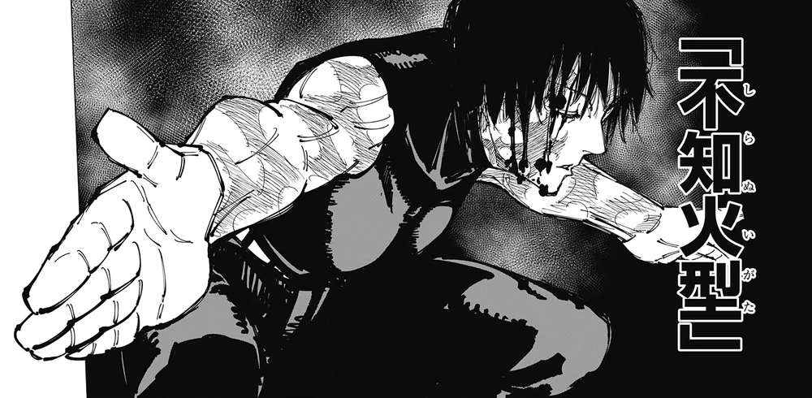

## Maki

Maki is a password-based encryption system for mnemonic seed phrases and other short secrets. It derives a strong key from a user’s password via Argon2id, encrypts with XChaCha20-Poly1305, and produces portable encrypted text designed for public storage.

## How to use

Build and start Maki from the project directory:

```sh
cargo run
```

Maki uses about 2 GiB of memory while deriving an encryption key. Protecting or recovering content may therefore pause briefly, and the computer must have enough memory available.

### Protect a secret

1. Press `Enter` on the opening screen and select **Protect**.
2. Accept the recommended maximum secret size of 4096 bytes (4 KiB), or enter a larger positive limit when the secret requires it.
3. Choose **Type or paste** to enter the secret in Maki, or **Read from file** to load its exact bytes from a file.
4. Choose whether to type the password or read its exact bytes from a file. Typed passwords are hidden by default; press `Ctrl+R` to reveal or hide them.
5. Press `Enter` to start. The result is portable text beginning with `maki:`.
6. Press `s` to save the encrypted text to a file.

Use a strong, unpredictable password and keep it available. Maki does not impose a password-size limit, and password files may contain arbitrary binary content. The exact same password bytes are required for recovery.

### Recover a secret

1. Select **Recover**.
2. Type or paste the complete `maki:` text, or read it from a file.
3. Supply the exact password used when the secret was protected.
4. Press `Enter` to start. Recovered content stays hidden until you press `r`.
5. Press `s` to save the recovered content to a file.

Maki determines the required recovery size from the encrypted input, so recovery does not ask for a secret-size limit.

An incorrect password or changed encrypted text will fail recovery instead of producing altered
content.
